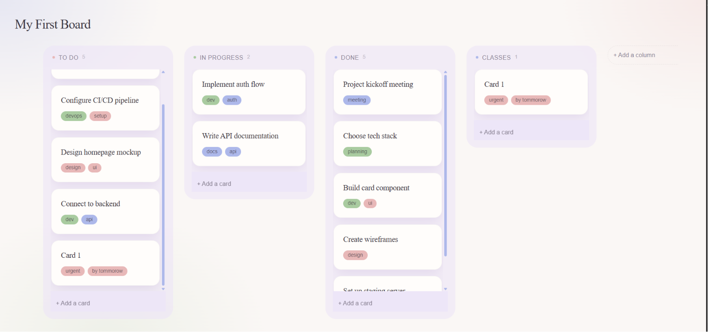

# Collably

A Kanban board built from scratch in React — no state management libraries, no drag-and-drop shortcuts left unexplained.



---

## Why this project exists

Most portfolio Kanban boards wrap a drag-and-drop library around a `useState` array and call it done. Collably was built to go deeper: a normalized data model, a hand-written reducer with full CRUD and cascade-delete semantics, drag-and-drop wired against the current-generation `@dnd-kit/react` API, verified render performance, and a from-scratch design system — all built and debugged from first principles rather than copied from a tutorial.

## Features

- Multiple columns per board, fully dynamic — add, delete (cascades to that column's cards), any number of columns
- Full card CRUD — add, delete, tag, all persisted
- Drag-and-drop — reorder within a column, move between columns, drop into empty columns, keyboard-accessible dragging
- localStorage persistence with lazy initialization and corrupted-data recovery
- Verified `React.memo` optimization, confirmed via React DevTools Profiler on a production build
- Custom Tailwind v4 design system — deliberate typography, color, and shadow tokens, not defaults

## Tech Stack

| Layer       | Choice                 | Why                                                                                                             |
| ----------- | ---------------------- | --------------------------------------------------------------------------------------------------------------- |
| UI          | React 19               | Function components, hooks throughout                                                                           |
| Build       | Vite                   | Fast dev server, native ESM                                                                                     |
| State       | `useReducer` + Context | See [State Management](#state-management--why-not-redux) below                                                  |
| Drag & Drop | `@dnd-kit/react`       | Current-gen dnd-kit (not the legacy `@dnd-kit/core`/`sortable`/`utilities` trio most tutorials still reference) |
| Styling     | Tailwind CSS v4        | `@theme` custom design tokens, no default palette                                                               |
| Persistence | `localStorage`         | Lazy-initialized, defensively parsed                                                                            |

## Architecture

### Data model

Cards and columns are stored as **flat, normalized arrays** rather than nested structures:

```js
boards: [{ id, title }];
columns: [{ id, title, boardId, position }];
cards: [{ id, title, columnId, position, tags: [] }];
```

This was a deliberate trade-off. Nesting cards inside columns (`column.cards = [...]`) seems natural at first, but it means every card move touches two different nested arrays in two different places. A flat structure with `columnId`/`position` references makes every update a single, predictable, easily-testable operation — the same principle behind normalizing a relational database, applied to component state.

### State management — why not Redux?

`useReducer` + Context, not an external library. This was a conscious choice, not a default: for an app this size, `useReducer` gives every benefit that matters (centralized update logic, predictable action-based mutations, easy to test in isolation) without an added dependency. The known limitation — Context re-renders every consumer on any value change, with no built-in selector mechanism — was identified, measured, and addressed directly (see [Performance](#performance) below) rather than reached for as a reason to bring in Redux/Zustand prematurely.

### Reducer design

Every mutating action follows the same discipline: never mutate state directly, always return new array/object references for anything that changed, and reindex `position` fields whenever cards or columns are added, removed, or reordered — including cascading deletes (removing a column removes its cards; removing a card reindexes the remaining ones in that column, and only that column).

### Drag-and-drop


Built on `@dnd-kit/react` — the actively maintained rewrite of dnd-kit, not the legacy `core`/`sortable`/`utilities` packages most existing tutorials cover. Notable implementation decisions:

- **The built-in `OptimisticSortingPlugin` is deliberately disabled.** It causes a real, currently-open library issue ([clauderic/dnd-kit#1747](https://github.com/clauderic/dnd-kit/issues/1747)) — a DOM reconciliation crash when combining its automatic DOM manipulation with React-driven state updates on cross-column moves. Collably instead reads `event.operation.target` directly in `onDragEnd` and lets React own every DOM update, trading a small amount of live drag-preview smoothness for full correctness and no reconciliation conflicts.
- Card and column IDs are guaranteed non-colliding, since dnd-kit tracks all draggable/droppable entities in a single shared identifier namespace regardless of type.
- Empty columns are valid drop targets via `useDroppable` with `collisionPriority: Low`, so cards prioritize colliding with other cards but still land correctly in an empty column.

### Performance

Initial implementation re-rendered every `Card` and `Column` on any board mutation, even in unrelated columns — confirmed via React DevTools Profiler. Root cause: a naive per-render grouping of cards by column produced a new array reference for every column on every state change, defeating `React.memo` regardless of whether that column's actual data had changed.

Fixed with a custom hook (`useCardsByColumn`) that rebuilds the card-to-column grouping but **reuses the previous render's array reference** for any column whose contents didn't actually change — verified by comparing card object references (not deep equality), since the reducer already guarantees any genuinely-changed card gets a new object reference. The fix was verified on a **production build with a profiling-enabled React alias** (dev-mode Profiler output proved unreliable/self-contradictory during initial testing — a deliberate methodological choice, not an oversight).

## What I'd build next

- Multi-board support (data model already supports it; UI currently assumes a single board)
- Fractional/float-based position indexing to avoid full-column reindexing on every reorder, for boards with very large card counts
- Real backend + auth, swapping the reducer's local dispatch for optimistic updates against a server

## Running locally

```bash
git clone <repo-url>
cd collably
npm install
npm run dev
```

---

Built by [shreyas kumar] — [LinkedIn](https://www.linkedin.com/in/shreyas-kumar-3455aa1a4/) · [GitHub](https://github.com/sheyas29)
